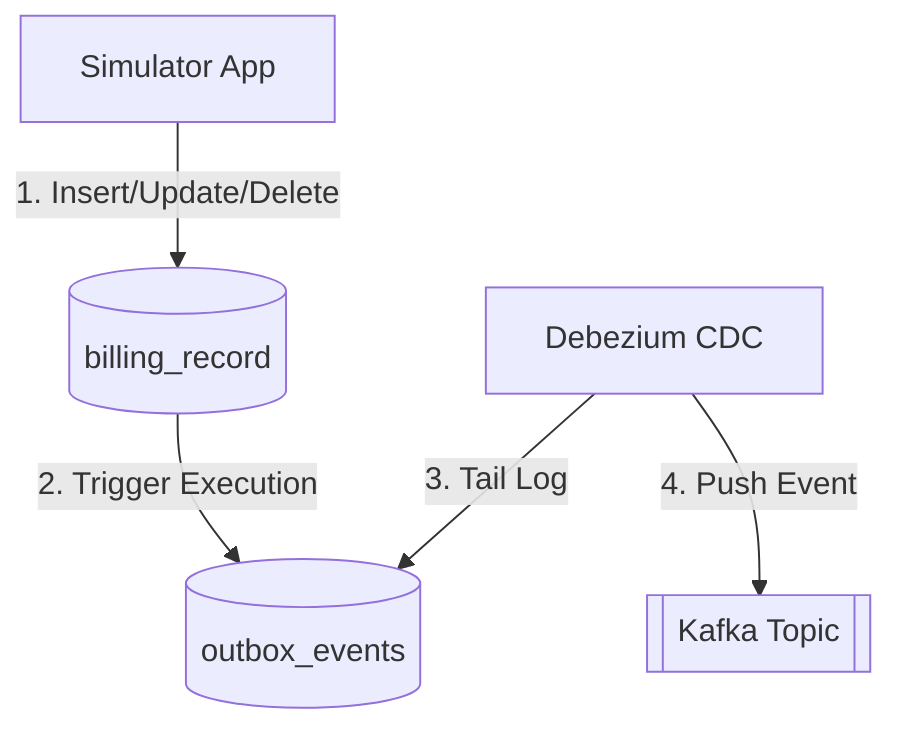

# Approach 1: Database Triggers (DBA Outbox)

**Description:**
This approach relies on database triggers to capture mutations on the domain table (`billing_record`) and automatically insert a corresponding event into the `outbox_events` table. Debezium then tails the transaction log for the outbox table to push events to Kafka.

### Pros:
- **Zero Application Changes**: Application code doesn't need to be modified significantly, as the event generation logic is pushed entirely to the database.
- **Guaranteed Consistency**: Ensures an event is created in the exact same transaction as the domain entity mutation.

### Cons:
- **High Performance Overhead**: Database triggers can significantly slow down write operations (Inserts/Updates/Deletes).
- **Maintenance Burden**: Triggers are notoriously difficult to debug, trace, and version-control compared to application code.
- **Tight Coupling**: Business logic for event publishing gets tightly coupled with the database schema.
