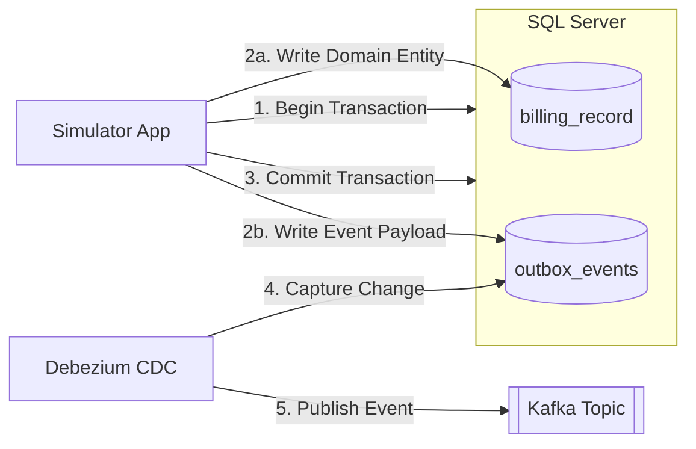

# Approach 2: Transactional Outbox (Recommended)

**Description:**
The application writes to both the domain table and the outbox table within a single ACID transaction. This ensures guaranteed delivery without the overhead and maintenance complexity of database triggers. Debezium captures the outbox events directly.

### Pros:
- **Reliable Exactly-Once Delivery**: Eliminates dual-write issues and ensures the event is successfully recorded alongside the business data.
- **Better Performance**: Performs significantly better than database triggers while maintaining the same strong consistency guarantees.
- **Application Control**: Event generation logic lives in the application code, making it easier to test, version, and debug.

### Cons:
- **Code Modifications**: Requires changes to application code to ensure domain writes and outbox writes happen within the same transaction scope.
- **Infrastructure Requirements**: Still requires robust CDC infrastructure (like Debezium) to securely poll the outbox and push to the broker.
