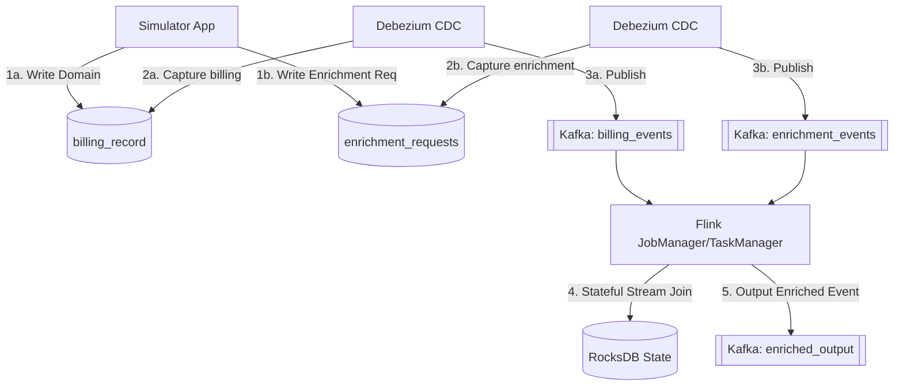

# Approach 3: Stream-to-Stream Join (Flink)

**Description:**
Dual writes populate domain and enrichment tables separately. Changes are streamed via CDC into Kafka topics. Apache Flink performs a stateful stream-to-stream join to enrich the events in real-time. This can face issues with state TTL and late-arriving data.

### Pros:
- **Highly Scalable**: Flink provides a highly robust, distributed state backend capable of processing massive volumes of events.
- **Complete Decoupling**: The database is completely offloaded from any enrichment responsibility; the streaming layer handles all complex event processing.

### Cons:
- **Operational Complexity**: Managing a Flink cluster (JobManagers, TaskManagers, RocksDB state, checkpointing) adds substantial infrastructure complexity.
- **Late-Arriving Data**: Stateful joins are susceptible to dropping events if data arrives out-of-order or after the State Time-To-Live (TTL) has expired.
