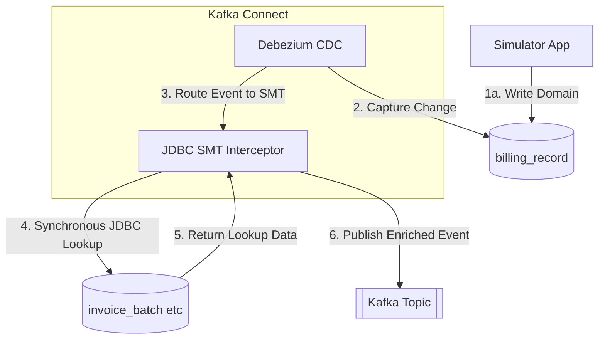

# Approach 4: JDBC SMT (Interceptor)

**Description:**
Kafka Connect intercepts the CDC event using a Single Message Transform (SMT) and performs a synchronous JDBC query back to the database to enrich the event payload before it is published to Kafka. This can introduce latency and race conditions if lookup data mutates quickly.

### Pros:
- **Simplified Stack**: Requires no external streaming processing applications like Flink. Everything is configured and centralized inside Kafka Connect.
- **Always Up-to-Date**: Ensures the event gets the most current state of the joined data exactly at the moment it passes through the connector.

### Cons:
- **Race Conditions**: Highly susceptible to race conditions. If the database updates rapidly before the SMT queries it, the event might be enriched with future/incorrect state.
- **Bottleneck Risk**: Introduces synchronous database lookups into the critical CDC streaming path, potentially causing massive bottlenecks during high throughput.
