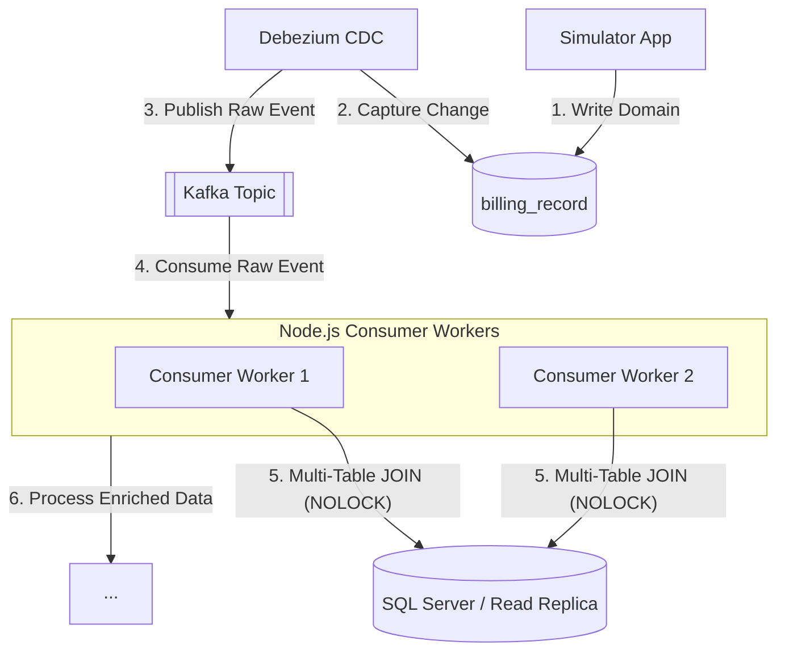

# Approach 5: CDC Push + Consumer Enrichment

**Description:**
Debezium captures and pushes raw changes immediately. Downstream consumer workers consume the raw events from Kafka and enrich them by performing direct, non-blocking multi-table JOINs (often against a read replica or using NOLOCK hints) before passing the fully enriched event to its final destination.

### Pros:
- **High Ingestion Throughput**: The CDC pipeline remains incredibly fast and unblocked, as no transformations or synchronous actions occur in Kafka Connect.
- **Horizontal Scalability**: Consumer workers can be easily scaled out to handle heavy processing/enrichment loads concurrently.

### Cons:
- **Increased Database Load**: Shifting enrichment queries to the consumer side can cause heavy read traffic on the database (mitigated by using Read Replicas).
- **Idempotency Requirements**: Because consumers handle enrichment and final delivery, they must carefully handle duplicate events and implement strong idempotency.
