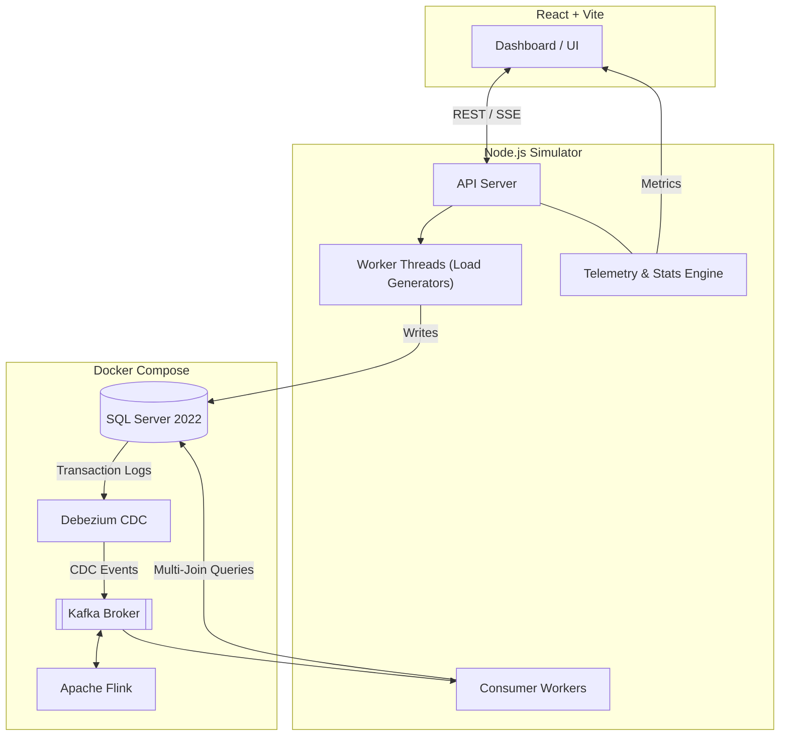

# Overall Architecture

```mermaid
flowchart TD
    subgraph Frontend ["React + Vite"]
        Dashboard["Dashboard / UI"]
    end

    subgraph Backend ["Node.js Simulator"]
        API["API Server"]
        Workers["Worker Threads (Load Generators)"]
        Consumers["Consumer Workers"]
        Telemetry["Telemetry & Stats Engine"]
    end

    subgraph Infrastructure ["Docker Compose"]
        DB[("SQL Server 2022")]
        CDC["Debezium CDC"]
        Broker[["Kafka Broker"]]
        Flink["Apache Flink"]
    end

    Dashboard <-->|"REST / SSE"| API
    API --> Workers
    Workers -->|"Writes"| DB
    DB -->|"Transaction Logs"| CDC
    CDC -->|"CDC Events"| Broker
    Broker <--> Flink
    Broker --> Consumers
    Consumers -->|"Multi-Join Queries"| DB
    Telemetry -->|"Metrics"| Dashboard
    API --- Telemetry
```
